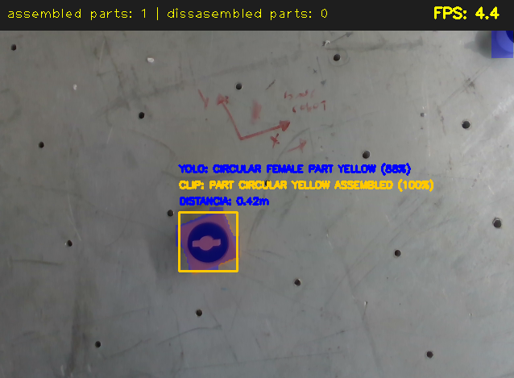
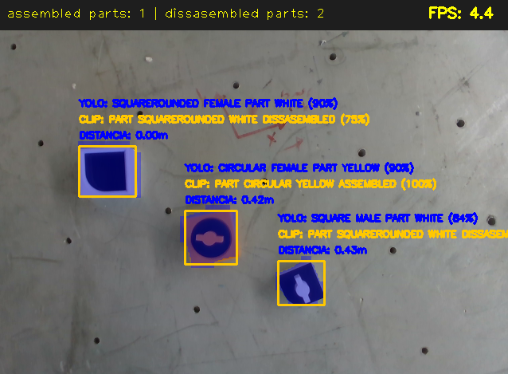
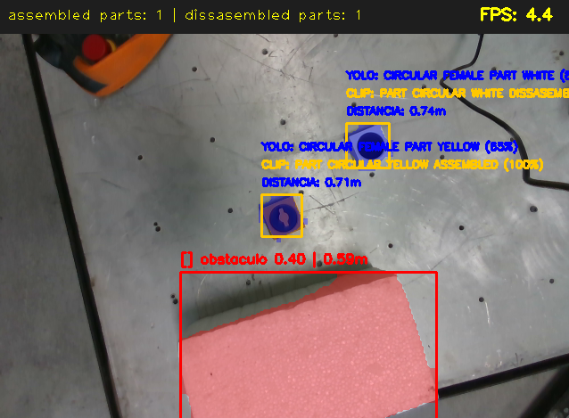

# proyecto-vision-artificial
# Generación de conjuntos de entrenamiento para detección y reconocimiento de objetos de ensamble mediante un sistema de visión 

Este repositorio contiene la documentación, scripts, datasets y cuadernos de entrenamiento para el sistema de detección y reconocimiento de objetos de ensamble.

##  Cuadernos de Entrenamiento (Google Colab)

Puedes revisar y ejecutar los entornos de entrenamiento de los modelos directamente en google colab

| Modelo | Enlace de Acceso Directo |
| :--- | :--- |
| **Entrenamiento CLIP** |  |
| **Entrenamiento YOLOv11** |  |
| **Entrenamiento YOLOE** |  |
| **INFERENCIA DE PROMPTS PARA YOLOE** |  |

---

##  Modelos Entrenados (Pesos .pt)

Los archivos con los pesos óptimos obtenidos tras los entrenamientos se encuentran alojados en la siguiente carpeta compartida de Google Drive. 

*  [Descargar Pesos de los Modelos (YOLO, YOLOE y CLIP)](https://drive.google.com/drive/folders/1v8PbTGbu0utwCL89MzKtbMJwgR01BEps?usp=sharing)

> **Nota:** Es necesario colocar los archivos `.pt` descargados dentro del directorio correspondiente del sistema para asegurar que el script principal los localice correctamente al iniciar el programa.

## Dataset de Imágenes
El conjunto de imágenes utilizado para el entrenamiento está disponible en la siguiente carpeta compartida de Google Drive:

* [Descargar Dataset de Imágenes](https://drive.google.com/drive/folders/10ov4fexS-W1VysfWcMt03ZtJe6OicwLt)

## Arquitectura y Flujo del Sistema Principal

1. **Captura y Alineación (Intel RealSense):** Adquisición sincronizada de flujos de color y profundidad en tiempo real, alineando los mapas métricos para el cálculo espacial[cite: 1].
2. **Detección Dual (YOLOE):** Uso de un modelo personalizado para localizar piezas de ensamble y un modelo base por vocabulario abierto para la segmentación y filtrado de obstáculos[cite: 1].
3. **Clasificación Contextual (CLIP):** Evaluación de recortes de las piezas detectadas mediante hilos concurrentes para determinar su estado detallado (ensamblado/desensamblado)[cite: 1].

## Funcionamiento del Sistema

### Componentes Clave

* **`requirements.txt`**: Archivo de dependencias que instala el entorno necesario 
* **`vision/`**: Contiene la lógica del sistema y los scripts de ejecución principal.
* **`vision/entrenamientos/`**: Carpeta destinada a los cuadernos `.ipynb` de preparación de datos y entrenamiento de CLIP (empleando un conjunto de 700 imágenes) y YOLO (configurado con 1,500 objetos segmentados por clase).
